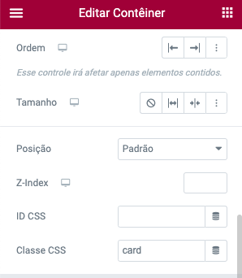

# Como utilizar o código CSS no Elementor?

- Crie um novo container, dentro desse container, coloque outro container, nesse segundo container coloque um bloco de texto (H2 e p).

- Aplique a classe css `card` no primeiro container.
- No segundo container a classe `card__body`.

 

`Container > Avancado > Layout > Classe CSS`

 

`Container > Avancado > Layout > Custom CSS`

 

